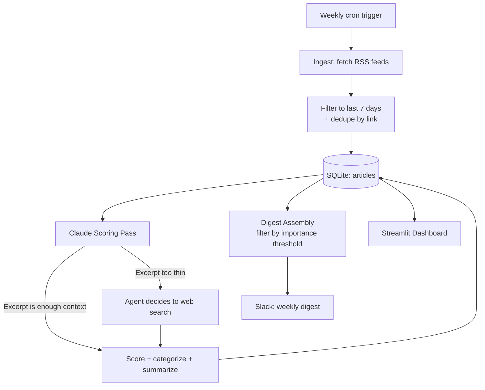

# Localization & Technology News Intelligence Agent

An autonomous agent that monitors localization, TMS/vendor, gaming, and AI industry RSS
feeds, uses Claude to judge relevance and — when it decides it needs to — search the web
for more context before scoring, then delivers a weekly curated digest to Slack. Built to
replace the manual habit of checking a dozen industry sites for signal worth knowing about.

Built by Inyoung Kim — a Localization Project Manager who applies hands-on automation and
AI/MT skills to build more efficient localization workflows. [LinkedIn](https://linkedin.com/in/inyoungee) · [Portfolio](https://inyoungee.github.io/portfolio/)

---

## Why this exists

Staying current in localization and AI/MT means reading across a scattered set of industry
sites, vendor blogs, and general tech news — most of which isn't relevant on any given day.
This project automates the filtering: Claude evaluates every article against the lens of
what actually matters to a localization PM, not generic keyword matching, and only the
genuinely significant ones make it into the weekly digest.

## What makes this an *agent*, not just automation

The ingestion and delivery stages are deterministic — fetch feeds, store, send a digest.
The scoring stage is where real agentic behavior lives: Claude is given a `web_search` tool
and explicit discretion over when to use it. For most articles, the RSS excerpt is enough
context to judge relevance. For thinner ones — a funding round, an acquisition, a product
launch with little detail — Claude independently decides to search for more before scoring,
rather than guessing from an incomplete excerpt. That's a model making a real decision about
whether to take an action, not a fixed step every article goes through.

## Architecture



## Key Features

- **Multi-source RSS ingestion** across localization industry, TMS/vendor blogs, gaming
  industry, and general AI/tech news, filtered to a recent-article window so a feed's full
  history is never processed as "new."
- **Calibrated relevance scoring** — Claude scores each article 1-5 against concrete,
  role-specific anchors (not a vague scale), categorizes it, and writes a one-sentence
  summary.
- **Agentic web search** — Claude has real discretion to research an article further before
  scoring it, tracked and surfaced explicitly in the dashboard as evidence of actual
  tool-use decision-making.
- **Weekly Slack digest** — grouped by category, sorted by importance, only articles above
  a configurable threshold are included.
- **Streamlit archive dashboard** — score distribution, category breakdown, a filterable
  full archive (by score/category/source/date range), and a dedicated view of every article
  where the agent chose to research further.
- **Scheduled via cron** — runs independently of any always-on process, appropriate for a
  weekly cadence rather than a continuously-running server.

## Tech Stack

| Layer | Tools |
|---|---|
| Ingestion | Python, feedparser |
| Reasoning | Anthropic Claude API (with web search tool use) |
| Data | SQLite |
| Delivery | Slack Incoming Webhooks |
| Dashboard | Streamlit, Plotly, Pandas |
| Scheduling | cron |

## Demo
### Streamlit Dashboard


### Slack notification


## Setup

1. Install dependencies:
   ```bash
   pip install -r requirements.txt
   ```
2. Copy `.env.example` to `.env` and fill in your own credentials:
   ```
   ANTHROPIC_API_KEY=
   NEWS_SLACK_WEBHOOK_URL=
   ```
3. Run the full pipeline manually once to confirm everything works:
   ```bash
   python news_weekly_run.py
   ```
4. Schedule it weekly via cron:
   ```bash
   crontab -e
   # 0 9 * * 1 cd /path/to/project && /path/to/project/.venv/bin/python news_weekly_run.py >> cron_output.log 2>&1
   ```
   On macOS, `cron` typically needs Full Disk Access granted in System Settings →
   Privacy & Security before scheduled jobs will actually run.
5. View the dashboard:
   ```bash
   streamlit run streamlit_news_dashboard.py
   ```

## Known Limitations

- **"Specific Month" date filter sets a lower bound only** — selecting a month shows
  everything from that month onward, not an isolated single-month window.
- **Not every source could be included** — some sites (e.g. MultiLingual) actively block
  automated feed requests (HTTP 403), which was treated as a boundary to respect rather
  than circumvent.
- **Web search usage is Claude's own judgment call**, not a guaranteed step — the dashboard
  reports how often it actually happens rather than assuming a fixed rate.
- **Weekly cadence is a deliberate choice**, not a technical ceiling — the pipeline could
  run more frequently, but most of the included sources don't post often enough to justify it.

## Engineering Notes

- **A missing `max_tokens` headroom silently truncated JSON responses** mid-field — the
  failure only surfaced as a JSON parse error downstream, not as an obviously related
  token-limit issue, which took closer inspection of the exact truncation point to diagnose.
- **An under-specified 1-5 scoring prompt collapsed toward the low end** — scores only
  started using the full range once the prompt included concrete, role-specific anchors
  for each number rather than a generic description.
- **A relative (not absolute) SQLite database path caused silent data-splitting** — running
  scripts from different working directories created separate, independent database files
  with the same name, with no error to indicate the mismatch.
- **One RSS feed returned 869 entries on a single fetch** — turned out to be a feed with no
  practical limit on history depth; fixed by filtering on each entry's actual publish date
  at ingestion time, not just trusting feed size.

## Near-Term Roadmap

- Proper upper-bound date range filtering ("just March," not "March onward")
- Per-source configurable recency windows, based on each site's actual posting cadence
- Optional daily-digest mode for faster-moving sources

## Future Project Roadmap: Personal Localization Intelligence Dashboard

This project is the first piece of a larger system — a decision-support dashboard combining
three sources of signal into one view:

```
Localization News Intelligence  +  Localization Job Intelligence  +  Personal Localization Profile
          (this project)                  (planned)                        (planned)
                    \                        |                        /
                     \                       |                       /
                       Personal Localization Intelligence Dashboard
```

- **Localization News Intelligence** *(built)* — this project. Tracks industry, AI/MT, and
  vendor trends via Claude-scored RSS ingestion.
- **Localization Job Intelligence** *(planned)* — an agent that ingests job postings via
  legitimate sources (Gmail job-alert parsing, public ATS board APIs, job-aggregator APIs —
  not LinkedIn scraping, which its Terms of Service prohibit) and uses Claude to assess
  each posting's fit against a structured profile, surfacing real skill-demand trends rather
  than raw listings.
- **Personal Localization Profile** *(planned)* — a structured, self-maintained record of
  skills, experience, and interests that both the job-matching engine and the combined
  dashboard reason against.
- **Combined Dashboard** *(planned)* — the value isn't any single feed in isolation, but the
  cross-referencing: skills trending in both industry news and job postings at once, and
  where the personal profile has a real gap against current market demand — synthesized
  insight neither source gives alone.
